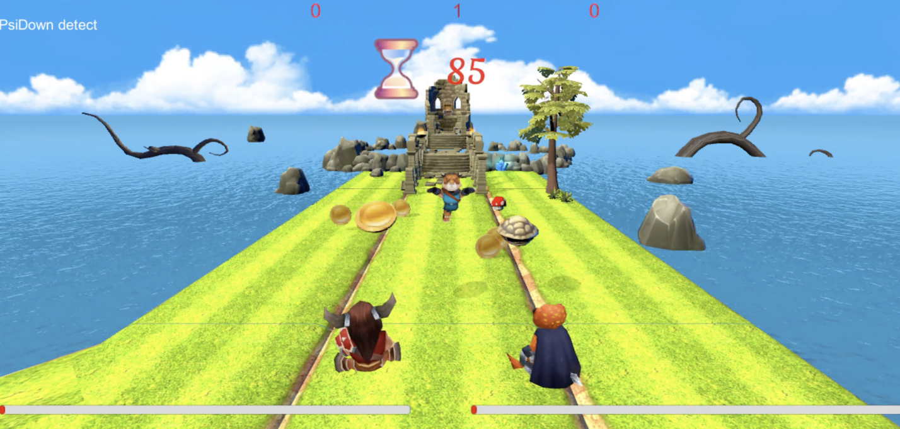

# Party_Animals

>## Abstract:
>>With the rise of Virtual Reality, VR gaming in physically co- present social settings is becoming more important, and the interaction between the VR players and non-VR players pose an interesting game design challenge.Previous work have explored having non VR players using only controllers, resulting in limited immersion and overlooked co-presence cues. We designed and implemented Party An- imals, a VR party game that empowered non-VR users to interact through body gestures and also used physical co-presence cues in the gameplay. The results of our eval- uation showed that the immersion of non-VR players was indeed promoted. Party Animals explored new interaction between VR and non-VR players, and integrates physical co-presence cues with the virtual world gameplay.

+ Paper:[http://dl.acm.org/citation.cfm?id=3048409](http://dl.acm.org/citation.cfm?id=3048409)
+ Video:[https://www.youtube.com/watch?v=RUDycSyPNZs&feature=youtu.be](https://www.youtube.com/watch?v=RUDycSyPNZs&feature=youtu.be)
